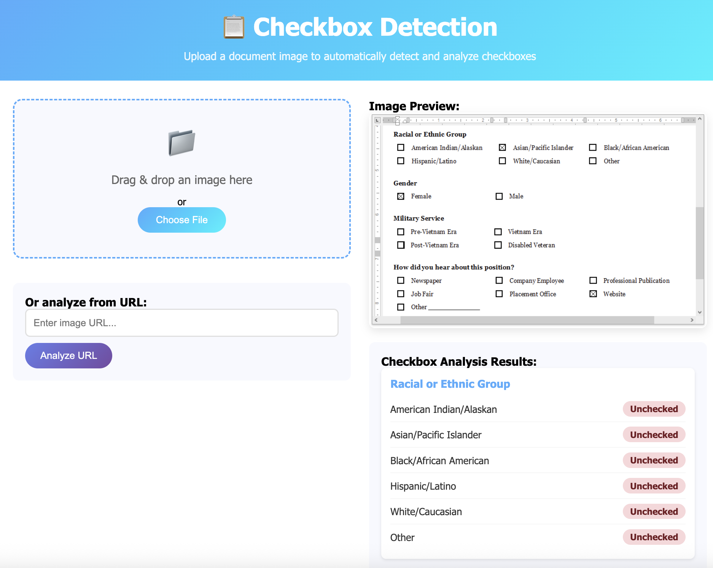

### Work in Progress
The LLM is just straight out of the Ollama repository. I am working to fine-tune it for this task. 

# Checkbox Detection System
A complete web application for detecting and analyzing checkboxes in document images using Ollama and the granite3.2-vision:2b model.




## Features

- 🔍 **Checkbox Detection**: Automatically detect checked and unchecked boxes in document images
- 📝 **Structured Output**: Returns results in organized JSON format with nested structures for grouped options
- 🖼️ **Multiple Input Methods**: Support for file uploads and image URLs
- � **Web Interface**: Beautiful, responsive frontend for easy interaction
- �🏥 **Health Monitoring**: Built-in health check endpoints
- 🚀 **Fast Processing**: Powered by Ollama's local inference
- 📱 **Mobile Friendly**: Responsive design works on all devices

## Prerequisites

- Python 3.8+
- Ollama installed and running
- granite3.2-vision:2b model (automatically pulled on startup)

## Installation

1. Clone or download the project files
2. Install dependencies:
   ```bash
   pip install -r requirements.txt
   ```

## Quick Start

### Option 1: Run Everything (Recommended)
```bash
python start_app.py
```
This starts both the backend API and frontend web interface.

### Option 2: Run Separately

**Start Backend:**
```bash
python api.py
```

**Start Frontend:**
```bash
python serve_frontend.py
```

### Option 3: Manual Setup

**Manual Backend Setup:**
```bash
python api.py
```

The API server will start on `http://localhost:8000`

## Web Interface

Once the servers are running, open your browser to:
- **Frontend**: http://localhost:3000/frontend.html
- **API Documentation**: http://localhost:8000/docs

### Frontend Features

- 📁 **Drag & Drop**: Simply drag image files onto the upload area
- 🔗 **URL Support**: Analyze images directly from web URLs
- 👀 **Image Preview**: See your uploaded image before analysis
- 📊 **Visual Results**: Clean, organized display of checkbox results
- 📱 **Responsive Design**: Works on desktop, tablet, and mobile
- ⚡ **Real-time Status**: Live API health monitoring

### API Endpoints

#### Health Check
```bash
GET /health
```

Returns the API status and model availability.

#### Analyze Checkboxes (File Upload)
```bash
POST /analyze-checkboxes
```

Upload an image file to analyze checkboxes.

**Example using curl:**
```bash
curl -X POST "http://localhost:8000/analyze-checkboxes" \
     -H "accept: application/json" \
     -H "Content-Type: multipart/form-data" \
     -F "file=@your-document.png"
```

#### Analyze Checkboxes (URL)
```bash
POST /analyze-checkboxes-url?image_url=<URL>
```

Analyze checkboxes from an image URL.

**Example using curl:**
```bash
curl -X POST "http://localhost:8000/analyze-checkboxes-url?image_url=https://example.com/form.png"
```

### Response Format

The API returns structured JSON with detected checkboxes:

```json
{
  "success": true,
  "image_info": {
    "size": [731, 467],
    "mode": "P",
    "format": "PNG"
  },
  "checkbox_analysis": {
    "Gender": {
      "Male": "Unchecked",
      "Female": "Checked"
    },
    "Race or Ethnicity": {
      "American Indian/Alaska Native": "Unchecked",
      "Asian/Pacific Islander": "Checked",
      "Black/African American": "Unchecked"
    },
    "Military Service": "Checked"
  },
  "filename": "document.png"
}
```

### Test the API

Run the test client:

```bash
python test_api.py
```

### Interactive Documentation

Once the server is running, visit:
- **Swagger UI**: http://localhost:8000/docs
- **ReDoc**: http://localhost:8000/redoc

## Model Configuration

The API uses the `granite3.2-vision:2b` model by default. You can modify the model by changing the `MODEL_NAME` variable in `api.py`.

## Supported Image Formats

- PNG
- JPEG
- JPG
- And other formats supported by PIL

## Error Handling

The API includes comprehensive error handling for:
- Invalid file types
- Model processing errors
- Network issues (for URL-based analysis)
- JSON parsing errors

## Development

To run in development mode with auto-reload:

```bash
uvicorn api:app --reload --host 0.0.0.0 --port 8000
```

## License

This project is open source and available under the MIT License.
# checkbox-detection
